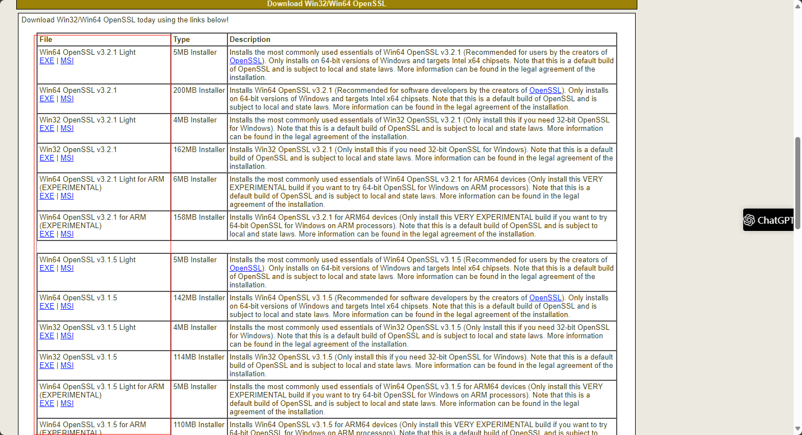
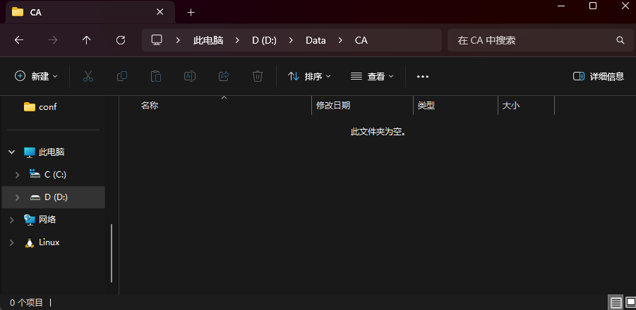
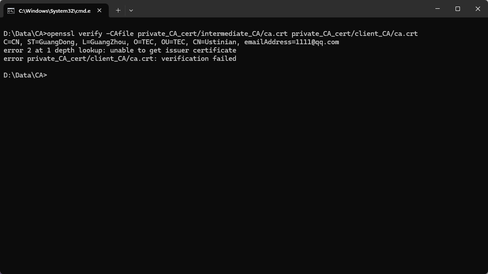
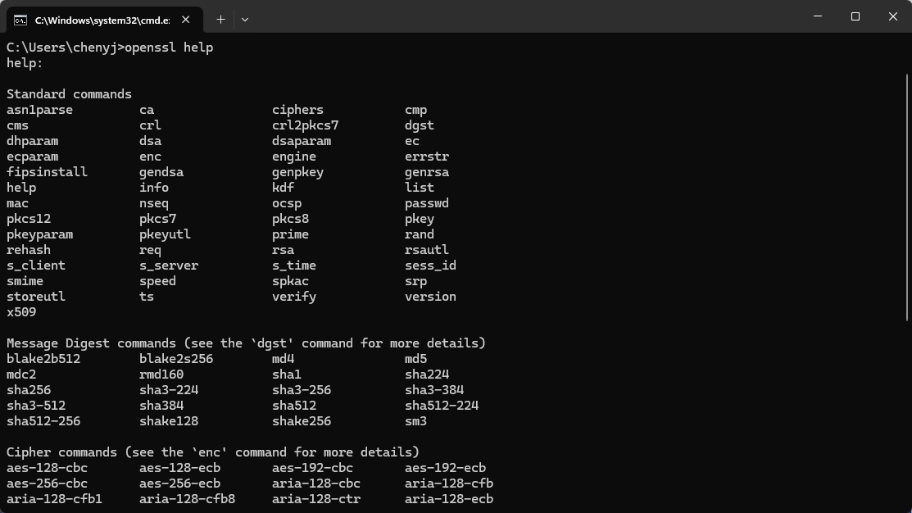

## 前言

最近在解决复现一个 Bug 时，需要配置 HTTPS 服务，由于 HTTPS 需要用到 SSL 证书，所以需要了解一下 OpenSSL，经过一番折腾，终于配置成功，为此记录一下。

## 目录

### 一、简介

OpenSSL 是目前最流行的 SSL 密码库工具，其提供了一个通用、健壮、功能完备的工具套件，用以支持 SSL/TLS 协议的实现。

> 官网：https://www.openssl.org/ <br>
> 其它下载渠道：https://slproweb.com/products/Win32OpenSSL.html

下面列表选择最新的下载，一直下一步下载即可。下载完成后配置一下环境变量（老生常谈了）。



### 二、使用

#### 1. RSA 密钥操作

默认情况下，`OpenSSL` 输出格式为 `PKCS#1-PEM` 格式

> 注：有关格式的详细介绍可以看这篇文章 https://www.cnblogs.com/LittleHann/p/3738141.html

创建一个干净的 `CA` 文件夹来存放我们的，如图：



- 生成 RSA 私钥（无加密，2048 位）

```bash
openssl genrsa -out rsa_private.key 2048
```

- 生成 RSA 公钥

```bash
openssl rsa -in rsa_private.key -pubout -out rsa_public.key
```

- 生成 RSA 私钥（使用 aes256 加密，2048 位）

```bash
openssl genrsa -aes256 -passout pass:123456 -out rsa_aes_private.key 2048
```

- 生成 RSA 公钥（使用 aes256 加密）

```bash
openssl rsa -in rsa_aes_private.key -passin pass:123456 -pubout -out rsa_aes_public.key
```

> 注：passout 代替了 shell 进行密码输入。

#### 2. 自签名证书

自签名证书顾名思义就是用户自己给自己签发的证书。自签名证书是免费的，但通常不受浏览器和其他客户端的信任。

自签名证书又分成两种一种是带 CA 签名的，一种是不带 CA 签名的。

- 不带 CA 签名（自签私有证书）

> 注：请确保 private_cert 文件夹存在，否则会报错，后续同理

（1）生成证书私钥

```bash
openssl genrsa -aes256 -out private_cert/server.key 2048
```

（2）生成 CSR（证书签名请求）

```bash
openssl req -new -key private_cert/server.key -out private_cert/server.csr
```

执行后需要根据提示输入证书拥有者的一些信息：

> 若使用加密的私钥，则会提示需要输入密码

```bash
Enter pass phrase for rsa_aes_private.key:                          ← 私钥文件的密码
You are about to be asked to enter information that will be incorporated
into your certificate request.
What you are about to enter is what is called a Distinguished Name or a DN.
There are quite a few fields but you can leave some blank
For some fields there will be a default value,
If you enter '.', the field will be left blank.
-----
Country Name (2 letter code) [AU]:CN                                ← 国家代号，中国输入CN
State or Province Name (full name) [Some-State]:GuangDong           ← 省份名称，广东输入GuangDong
Locality Name (eg, city) []:GuangZhou                               ← 城市名称，广州输入GuangZhou
Organization Name (eg, company) [Internet Widgits Pty Ltd]:TEC      ← 公司英文名
Organizational Unit Name (eg, section) []:TEC                       ← 公司部门英文名
Common Name (e.g. server FQDN or YOUR name) []:Ustinian             ← 证书拥有者，输入你的名字
Email Address []:1111@qq.com                                        ← 邮箱地址

Please enter the following 'extra' attributes
to be sent with your certificate request
A challenge password []:123456                                      ← csr密码
An optional company name []:TEC                                     ← 签发机构名称
```

（3）生成自签私有证书

```bash
openssl x509 -req -days 365 -in private_cert/server.csr -signkey private_cert/server.key -out private_cert/server.crt
```

（4）也可以使用一条命令执行完成：

```bash
openssl req -new -x509 -newkey rsa:2048 -keyout private_cert/server.key -out private_cert/server.crt
# -new 表示生成一个新的证书 加上 -x509 表示生成自签名证书
# -key 指定生成一个新的私钥文件
# -days 365 标识证书有效期
# -out 指定生成的证书文件名
```

- 带 CA 签名（私有 CA 认证）

私有 CA 就是自己创建一个 CA 根证书代替权威 CA 机构，然后用私有的根证书签发客户端证书

（1）生成根证书

步骤和不带 CA 签名一样，直接执行命令：

```bash
openssl req -new -x509 -newkey rsa:2048 -keyout private_CA_cert/root_CA/ca.key -out private_CA_cert/root_CA//ca.crt -subj "/C=CN/ST=GuangDong/L=GuangZhou/O=TEC/OU=TEC/CN=Ustinian/emailAddress=1111@qq.com"
```

（2）创建中间证书（可不做）

中间 CA 是 root CA 的代理，其证书由 root CA 签发，同时中间 CA 能够代表根 CA 签发用户证书，

创建中间 CA 的好处是即使中间 CA 的私钥泄露，造成的影响也是可控的，我们只需要使用 root CA 撤销对应中间 CA 的证书即可。此外 root CA 的私钥可以脱机妥善保存，只需要在撤销和更新中间 CA 证书时才会使用。

```bash
# 创建中间 CA 的私钥
openssl genrsa -aes256 -out private_CA_cert/intermediate_CA/ca.key 2048
# 中间 CA 要向 root CA 申请公钥证书，就要首先产生一个 CSR，发送给 root CA 对其进行审查
openssl req -sha256 -new -key private_CA_cert/intermediate_CA/ca.key -out private_CA_cert/intermediate_CA/ca.csr -subj "/C=CN/ST=GuangDong/L=GuangZhou/O=TEC/OU=TEC/CN=Ustinian/emailAddress=1111@qq.com"
# 使用根证书签发中间 CA 证书
openssl x509 -req -days 7304 -CA private_CA_cert/root_CA/ca.crt -CAkey private_CA_cert/root_CA/ca.key -CAserial private_CA_cert/intermediate_CA/ca.srl -CAcreateserial -in private_CA_cert/intermediate_CA/ca.csr -out private_CA_cert/intermediate_CA/ca.crt
# -CA：指定 CA 证书的路径，这里为 root CA
# -CAkey：指定 CA 证书的私钥路径
# -CAserial：指定证书序列号文件的路径
# -CAcreateserial：表示创建证书序列号文件(即上方提到的serial文件)，创建的序列号文件默认名称为-CA，指定的证书名称后加上.srl后缀
```

（3）签发客户端证书

```bash
# 创建客户端证书的私钥
openssl genrsa -aes256 -passout pass:123456 -out private_CA_cert/client_CA/ca.key 2048
# 创建客户端证书的 CSR（注意：信息要和CA证书保持一致）
openssl req -sha256 -new -key  private_CA_cert/client_CA/ca.key -out private_CA_cert/client_CA/ca.csr -subj "/C=CN/ST=GuangDong/L=GuangZhou/O=TEC/OU=TEC/CN=Ustinian/emailAddress=1111@qq.com"
# 使用 CA 签发证书（这里我使用中间 CA）
openssl x509 -req -in  private_CA_cert/client_CA/ca.csr -CA private_CA_cert/intermediate_CA/ca.crt -CAkey private_CA_cert/intermediate_CA/ca.key -CAcreateserial -out  private_CA_cert/client_CA/ca.crt -subj "/C=CN/ST=GuangDong/L=GuangZhou/O=TEC/OU=TEC/CN=Ustinian/emailAddress=1111@qq.com"
```

（4）证书有效性验证

```bash
openssl verify -CAfile private_CA_cert/intermediate_CA/ca.crt private_CA_cert/client_CA/ca.crt
```

提示如下则说明验证通过：

> error 2 表示找不到颁发者证书。如果找到不受信任证书的颁发者证书，就会出现这种情况 <br>
> 1 depth 表示出错证书在证书链中深度



#### 3. 更多指令

有关 `OpenSSL` 指令，可以使用 `OpenSSL help` 命令可以查看 `OpenSSL` 提供的所有命令。



#### 4. OpenSSL 生成脚本

是不是感觉上面一套下来很麻烦，其实可以使用脚本来生成证书。这里我推荐一个脚本，使用起来非常方便。

> 脚本地址：<https://github.com/fufuok/FF.openssl.sh>

## 参考资料

[1]. [使用 openssl 生成证书（含 openssl 详解）](https://cloud.tencent.com/developer/article/1444793)

[2]. [秒懂 Https 之 CA 证书与自签名证书漫谈](https://zhuanlan.zhihu.com/p/163591254)

[3]. [利用 CA 私钥和证书创建中间 CA](https://www.cnblogs.com/Security-Darren/p/4079605.html)

[4]. [自签名证书和 CA 证书的区别和制作、使用](https://www.cnblogs.com/zhaobowen/p/13321578.html#2%E7%A7%81%E6%9C%89ca%E8%AE%A4%E8%AF%81)

```

```
