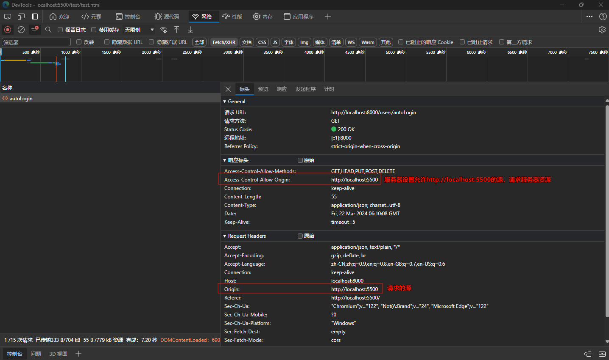
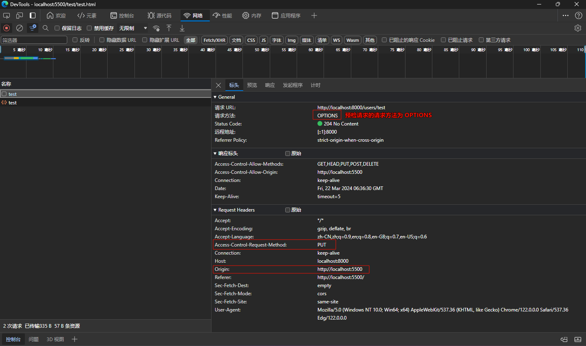
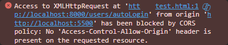
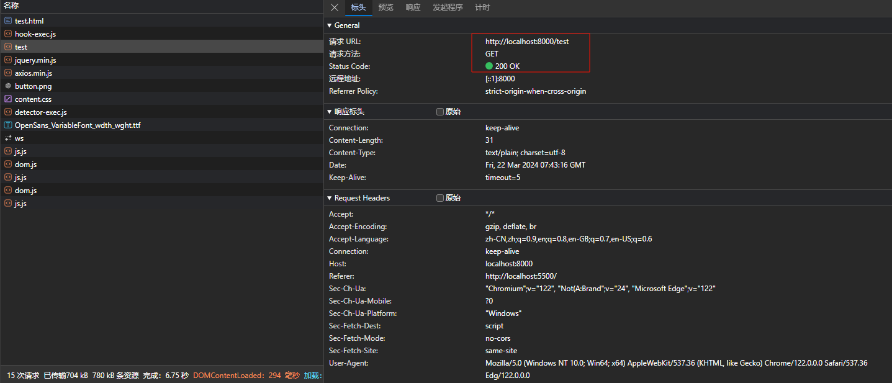

## 前言

最近在做项目的时候，遇到了跨域问题，对此查阅了一些资料，来记录一下

## 目录

### 一、同源安全策略

要想了解跨域，首先需要了解同源策略，同源策略是浏览器的一种安全机制，用于限制一个网页中的文档或脚本如何与来自不同来源的资源进行交互。

同源是指两个 `URL` 的协议、主机和端口号完全相同，如果两个 `URL` 在这三个方面有任何一个不同，就被认为是不同源。

下表给出了与 `URL` http://example.com/dir/test.html 的源进行对比的示例：

| URL                                    | 是否跨域 | 原因         |
| -------------------------------------- | -------- | ------------ |
| http://example.com/dir/test.html       | 同源     | 完全相同     |
| http://example.com/dir/other/test.html | 同源     | 只有路径不同 |
| https://example.com/dir/test.html      | 跨域     | 协议不同     |
| http://example.com:8081/dir/test.html  | 跨域     | 端口不同     |
| http://test.com/dir/test.html          | 跨域     | 主机不同     |

> 注：`localhost` 和 `127.0.0.1` 虽然都指向本机，但也属于跨域。

### 二、如何解决跨域问题

了解了跨域问题是这么产生的，那么如何解决跨域问题呢？解决跨域问题的方法很多，这里先介绍两种。

#### 1. CORS（跨域资源共享）

CORS（跨源资源共享 Cross-origin resource sharing）是一种通过服务器端设置 `HTTP` 头来允许跨域请求的机制。需要<font color='red'>浏览器</font>和<font color='red'>服务器</font>同时。整个 `CORS` 过程都是浏览器完成的，无需⽤户参与。因此实现 CORS 的*关键就是服务器，只要服务器实现了 CORS 请求，就可以跨源通信了*。

CORS 是一种标准化的机制，由 W3C 标准化，目前得到了广泛的支持。所有浏览器都支持该功能，IE 浏览器不能低于 IE10。

浏览器将 CORS 请求分成两类：简单请求（simple request）和非简单请求（not-so-simple request）。

> 简单请求不会触发 CORS 预检请求。

- 定义

::: info 若该请求满⾜以下两个条件，就可以看作是简单请求：

（1）请求方法是以下三种方法之一：

- HEAD
- GET
- POST

（2）HTTP 的头信息不超出以下几种字段：

- Accept
- Accept-Language
- Content-Language
- Last-Event-ID
- Content-Type：只限于三个值 application/x-www-form-urlencoded、- - multipart/form-data、text/plain

:::

- 过程

对于简单请求，浏览器直接发出 CORS 请求。具体来说，就是在头信息之中，增加一个 `Origin` 字段，该字段的值就是请求的源（协议 + 域名 + 端口）。服务器根据这个值，决定是否同意这次请求。

举个栗子：浏览器（http://localhost:5500）向服务器（http://localhost:8000）发起一个请求，由于端口不同两者之间存在跨域，当在服务器设置 `Access-Control-Allow-Origin`，标识允许哪个域的请求时，这个时候浏览器发起的请求就是 CROS 请求。在这里是简单请求。



::: warning 注意
有关服务器如何开启 CROS 跨域请求，不同语言下的设置方法不同，具体可以自行百度。
:::

> 非简单请求的 CORS 请求，会在正式通信之前，增加一次 HTTP 查询请求，称为"预检"请求（preflight）。

- 定义：除了简单请求，其他都属于非简单请求。一般是对服务器有特殊要求的请求，比如请求方法是 `PUT` 或 `DELETE`，或者 `Content-Type` 字段的类型是 `application/json`。

- 过程：

浏览器会先询问服务器，当前网页所在的域名是否在服务器的许可名单之中，以及可以使用哪些 HTTP 动词和头信息字段。只有得到肯定答复，浏览器才会发出正式的 XMLHttpRequest 请求，否则就报错。

举个栗子：浏览器（http://localhost:5500）向服务器（http://localhost:8000）发起了一个请求，由于请求方法为 `put`，会先发起一个预检请求，

::: info 预检方法与简单方法不同的是，options 请求多了 2 个字段：
Access-Control-Request-Method：该次请求的请求方式

Access-Control-Request-Headers：该次请求的自定义请求头字段
:::



服务器收到预检请求以后，检查了 `Origin`、`Access-Control-Request-Method` 和 `Access-Control-Request-Headers`字段以后，确认允许跨源请求，就可以做出回应。


#### 2.JSONP

由于同源策略，不同源的浏览器和服务器之间是无法沟通的，而 `HTML` 的 `<script>` 元素是一个例外。`<script>` 元素存在开放策略，网页跨域得到网页可以得到从其他来源动态产生的 `JSON` 资料，例如：`cdn` 加速

这种使用模式就是所谓的 `JSONP`。用 `JSONP` 抓到的资料并不是 `JSON`，而是任意的 `JavaScript`，用 `JavaScript` 直译器执行而不是用 `JSON` 解析器解析。

做个简单的测试，当我们在 http://localhost:5500 请求 http://localhost:8000/test 接口时

```JavaScript
axios({
	method: 'get',
	url: '"http://localhost:8000/test'
})
	.then(response => {})
	.catch(error => {})
	.then(() => {})
```

这个时候浏览器抛出异常，提示两者不同源



但是，当我们使用 `JSONP` 的方式请求：

```JavaScript
<script type="text/javascript" src="http://localhost:8000/test"></script>
```



可以看到，此时请求成功了，但是由于 `JSONP` 请求返回会立马被浏览器当作 `JavaScript` 语句去执行，但是请求到的数据格式并不符合其语法规范。因此浏览器会抛出错误。


那么，如何解决这个问题呢？

我们可以把请求的数据当作一个函数的参数，并且客户端存在这个函数的话，这样就可以形成一个回调的方式。当请求成功后，服务器端返回的数据作为参数传递给客户端的函数。代码实现如下：

- 客户端

```HTML
<div id="container"></div>
<script type="text/javascript">
  function callbackFunction(result) {
    var html = '<ul>';
    for (var i = 0; i < result.length; i++) {
      html += '<li>' + result[i] + '</li>';
    }
    html += '</ul>';
    document.getElementById('container').innerHTML = html;
  }
</script>
<script type="text/javascript" src="http://localhost:8000/test?callback=callbackFunction"></script>
```

- 服务端

```JavaScript
router.get('/test', async (ctx) => {
  let fnName = ctx.request.query.callback;
  console.log(fnName);
  let arr = ["Ustinian", "Throb"];
  ctx.body = `${fnName}(${JSON.stringify(arr)})`;
})
```

## 总结

1. 两种方式对比

CORS 与 JSONP 相比，更为先进、方便和可靠。

- JSONP 只能实现 `GET` 请求，而 CORS 支持所有类型的 `HTTP` 请求。
- 使用 CORS，开发者可以使用普通的 `XMLHttpRequest` 发起请求和获得数据，比起 JSONP 有更好的错误处理。
- JSONP 主要被老的浏览器支持，它们往往不支持 CORS，而绝大多数现代浏览器都已经支持了 CORS。

2. 更多解决跨域问题方式

解决跨域问题的方式有很多，除了 CORS 和 JSONP 之外，还有以下几种方式：

- PostMessage
- Nginx 反向代理
- 通过在页面中嵌入带有合适响应头的 iframe
- Vue设置代理服务
- WebSocket
- ......

## 参考资料

[1]. [跨域资源共享 CORS 详解 - 阮一峰](https://ruanyifeng.com/blog/2016/04/cors.html)

[2]. [跨域资源共享 CORS 详解](https://zhuanlan.zhihu.com/p/68738334)

[3]. [jsonp 跨域请求详解——从繁至简](https://zhuanlan.zhihu.com/p/24390509)
