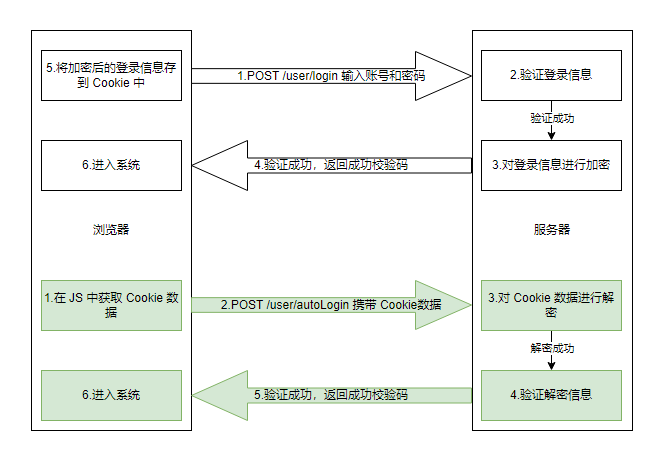
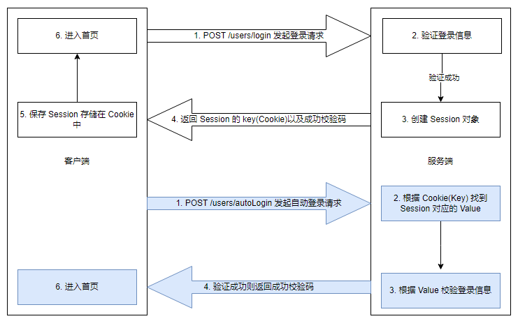

## 前言

自动登录是指在用户访问网站时，系统能够自动识别用户并进行登录，而无需用户手动输入用户名和密码。目前实现自动登录的主要有下面几种

1. Cookie
2. Session
3. Token

## 目录

### 一、cookie

#### 1. 什么是 Cookie？ Cookie 的作用是什么？

- Cookie 通常由服务器生成，并发送给浏览器，浏览器会将 Cookie 保存。当浏览器再次访问该网站时，浏览器会自动带上 Cookie，这样服务器就能通过 Cookie 判断出用户身份。
- Cookie 可以保存在浏览器的缓存中，浏览器关闭 Cookie 消失。也可以保存在客户端的硬盘文件中，浏览器关闭 Cookie 还在。除非手动清除。
- Cookie 的大小限制在 4KB 左右。
- Cookie 的值由一对键值对组成，格式如下：

```js
Set-Cookie: name1=value[; expires=GMTDate][; domain=domain][; path=path][; secure]
Set-Cookie: name2=value[; expires=GMTDate][; domain=domain][; path=path][; secure]
Set-Cookie: name3=value[; expires=GMTDate][; domain=domain][; path=path][; secure]
```

#### 2. 实现原理

在用户登录后，将登录信息如账号、密码等保存在 Cookie 中，并控制 Cookie 的过期时间。当用户再次访问网站时，检查 Cookie 中的登录信息，如果登录信息有效，则自动登录。但这种方式有风险，因为登录信息是以明文的方式保存在 Cookie 中，如果 Cookie 被拦截，那么用户的信息就会泄露。因此，一般不把密码等敏感信息先用 md5 等加密算法加密后再保存在 Cookie 中。如图所示：



#### 3. 代码实现

> 注：前端使用 axios 发起请求，后端使用的是 Koa2 框架，加密方式采用的是 node-rsa

- 前端发起请求 /user/login，响应成功将信息存放在浏览器的 cookie 当中

```HTML
<div class="container">
    <label for="username">User：</label>
    <input type="text" id="username"><br>

    <label for="password">Password：</label>
    <input type="text" id="password"><br>

    <label for="auto">自动登录：</label>
    <input type="checkbox" id="auto" value="auto"><br>

    <button onclick="login()">Login</button>
</div>
<script>
    function login() {
        axios({
            method: 'post',
            url: 'http://localhost:8000/users/login',
            withCredentials: true, // 允许携带cookies
            data: {
                username: $("#username").val(),
                password: $("#password").val(),
                auto: $("#auto").is(":checked"),
            }
        }).then(response => {
            if (response.data.code === 0) {
                alert(response.data.message);
            }
        }).catch(error => {
        }).then(() => {
        });
    }
</script>
```

- 后端验证登录信息，并对其信息进行加密后返回

```javascript
// 用户登录
async login(ctx, next) {
    const { username, auto } = ctx.request.body
    try {
        // getUserInfo从数据库中读取用户信息
        const { password, ...res } = await getUserInfo({ username })
        if (res) {
            // 勾选自动登录时，为浏览器设置cookies
            if (auto) {
                // 加密
                const pwd = rsa.encryptByPubKey(password, keys.pubKey);
                const name = rsa.encryptByPubKey(username, keys.pubKey);
                ctx.cookies.set('password', pwd, {
                    maxAge: 24 * 60 * 60 * 1000, // Cookie的过期时间，单位为毫秒
                    overwrite: true, // 是否允许覆盖同名的Cookie
                })
                ctx.cookies.set('username', name, {
                    maxAge: 24 * 60 * 60 * 1000, // Cookie的过期时间，单位为毫秒
                    overwrite: true, // 是否允许覆盖同名的Cookie
                })
            }
            ctx.body = {
                code: 0,
                message: '用户登录成功',
                result: null,
            }
        }
    } catch (err) {
        console.error('用户登录失败', err);
    }
}
```

- 前端携带 cookie 请求自动登录接口

```HTML
<script>
// ....忽略其它代码
function autoLogin() {
    axios({
        method: 'get',
        url: 'http://localhost:8000/users/autoLogin',
        withCredentials: true
    }).then(response => {
        if (response.data.code === 0) {
            alert(response.data.message);
        }
    }).catch(error => {
    }).then(() => {
    });
}
autoLogin();
</script>
```

- 后端 autoLogin 接口

```JavaScript
async autoLogin(ctx, next) {
    try {
        // 解密
        const pwd = rsa.decryptByPriKey(ctx.cookies.get('password'), keys.priKey);
        const name = rsa.decryptByPriKey(ctx.cookies.get('username'), keys.priKey);
        // getUserInfo从数据库中读取用户信息
        const { password, ...res } = await getUserInfo({ username: name })
        // 密码是否匹配
        if (pwd === password) {
            ctx.body = {
                code: 0,
                message: '用户登录成功',
                result: null
            }
            return;
        }
        ctx.body = {
            code: 1,
            message: '用户登录失败',
            result: null
        }
    } catch (err) {
        console.error('自动登录失败', err);
    }
}
```

### 二、Session

#### 1. 什么是 Session？ Session 的作用是什么？

- Session 在网络应用中称为“会话控制”，是服务器为了保存用户状态而创建的一个特殊的对象。它是基于 Cookie 实现的。
- Session 没有数据大小限制。
- Session 类似于一个 Map，里面可以存放多个键值对，是以 key-value 进行存放的。key 必须是一个字符串，value 是一个对象。
- 当浏览器访问服务器并发送第一次请求时，服务端会创建一个 Session 对象，生成一个类似于 key-value 的键值对，然后将 key（cookie）返回到浏览器（客户端），浏览器下次再访问时，携带 key（cookie），找到对应的 Session（value），客户的信息都保存在 Session 中。

> 注：Session 和 SessionStorage 之间没有任何的联系，Session 存储在服务端，而 SessionStorage 存储在客户端(浏览器)。

#### 2. 实现原理

由于 Session 只存在会话期间，当浏览器关闭时，Session 就会被删除，因此要实现 session 自动登录，就需要将 Session 进行持久化，这里我们可以借助 Cookie 来实现。步骤如下：

- 客户端第一次发起登录请求时，服务器先验证登录信息，如果信息正确，则创建一个 Session，并将 Session 的 key（cookie）返回给客户端，客户端将 Cookie 保存起来。
- 客户端再次登录会携带 Cookie 发起自动登录请求，会自动将 Session 的 key（cookie）发送给服务器，服务器根据 key 找到对应的 Session。
- 服务器验证 Session 中的用户信息，如果信息正确，则允许用户登录。

如图所示：



#### 3. 代码实现

> 前端使用 axios 发起请求，后端使用的是 Koa2 框架，通过 koa-session 中间件来实现 session 的自动登录。koa-session 可以极大简化 session 的使用。具体使用方式可以看这里 [koa-session](https://github.com/koajs/session)

- 前端代码不变同 Cookie 的一样，这里就不再赘述了
- 后端代码

```Javascript
// 用户登录
async login(ctx, next) {
    const { username, auto } = ctx.request.body
    try {
        // getUserInfo从数据库中读取用户信息
        const { password, ...res } = await getUserInfo({ username })
        if (auto) {
            ctx.session.username = username;
            ctx.session.password = password;
        }
        ctx.body = {
            code: 0,
            message: '用户登录成功',
            result: null,
        }
    } catch (err) {
        console.error('用户登录失败', err);
    }
}

async autoLogin(ctx, next) {
    try {
        // 判断 session 是否含有用户名和密码
        if (ctx.session.username && ctx.session.password) {
            // getUserInfo从数据库中读取用户信息
            const { password, ...res } = await getUserInfo({ username: ctx.session.username })
            if (ctx.session.password === password) {
                ctx.body = {
                    code: 0,
                    message: '用户登录成功',
                    result: null
                }
                return
            }
        }
        ctx.body = {
            code: 1,
            message: '用户登录失败',
            result: null
        }
    } catch (err) {
        console.error('自动登录失败', err);
    }
}
```

### 三、Token

#### 1. 什么是 Token？ Token 的作用是什么？

- Token 是一种身份验证机制，它是服务器颁发给客户端的一种凭证，用于验证客户端的身份。在 Web 应用程序中，Token 通常作为 HTTP 请求的头部或参数进行传递。在计算机中有一个专业术语成它为"令牌"。
- Token 可用于身份验证、授权和数据传输等场景。

  - 身份验证：用于证明用户身份的凭证，比如用户名密码、数字证书、或者单点登录的令牌。我们熟知的 JWT 就是一种 Token。
  - 授权：用于访问受保护资源的凭证，比如 OAuth 2.0 中的 Access Token 和 Refresh Token。
  - 数据传输：在编程语言中用于表示语法结构的特殊符号，比如编译器和解析器中的语法标记
  - ............

> 注：关于 Token 如何实现免登录的方案可以看我另外一篇文章：[基于 OAuth2.0 的 RefreshToken 免登录方案](https://juejin.cn/post/7036595438452944039)

## 总结

### 几种免登录方式优缺点

- Cookie

  - 优点：
    - 简单易用：通过在客户端存储数据，实现起来比较简单
    - 支持跨域
  - 缺点：
    - 不安全，容易受到跨站脚本攻击（XSS）和跨站请求伪造攻击（CSRF）
    - 存储限制，浏览器对单个 cookie 的大小有限制，对 Cookie 的数目有限制

- Session

  - 优点：
    - 相对于 Cookie，会话数据存储在服务器端，更难受到攻击。
    - 可以存储更多敏感数据，不受浏览器存储容量限制。
  - 缺点：
    - 性能开销：需要在服务器端维护会话数据，可能增加服务器负载。
    - 由于需要浏览器支持 cookie，因此移动端无法使用。

- Token

  - 优点：
    - 无状态：服务器不需要存储会话数据，降低了服务器负担。
    - 扩展性：适用于分布式系统和微服务架构。
    - 安全性：可以使用加密算法确保安全性。
  - 缺点：
    - 客户端存储：Token 通常存储在客户端，存在被盗用的风险。
    - 难以撤销：一旦颁发，除非 Token 过期或者被撤销，否则难以撤销。

## 参考资料

[1]. [各种登录方式所用到登录与认证原理](https://zhuanlan.zhihu.com/p/505283114)

[2]. [关于 Cookie 的两种设置方式](https://zhuanlan.zhihu.com/p/270181083#:~:text=%E5%85%B3%E4%BA%8E%20Cookie%20%E7%9A%84%E4%B8%A4%E7%A7%8D%E8%AE%BE%E7%BD%AE%E6%96%B9%E5%BC%8F%201%20%E7%AC%AC%E4%B8%80%E7%A7%8D%20%E9%80%9A%E8%BF%87%20HTTP%20%E6%96%B9%E5%BC%8F%E5%AF%B9,Request%20Headers%20%E4%B8%AD%E7%9A%84%20Cookie%20Header%202%20%E7%AC%AC%E4%BA%8C%E7%A7%8D%20%E9%80%9A%E8%BF%87JavaScript%E5%AF%B9document.cookie%E8%BF%9B%E8%A1%8C%E8%B5%8B%E5%80%BC%E6%88%96%E5%8F%96%E5%80%BC%E3%80%82)

[3]. [Session 详解](https://blog.csdn.net/m0_51545690/article/details/123384986)
